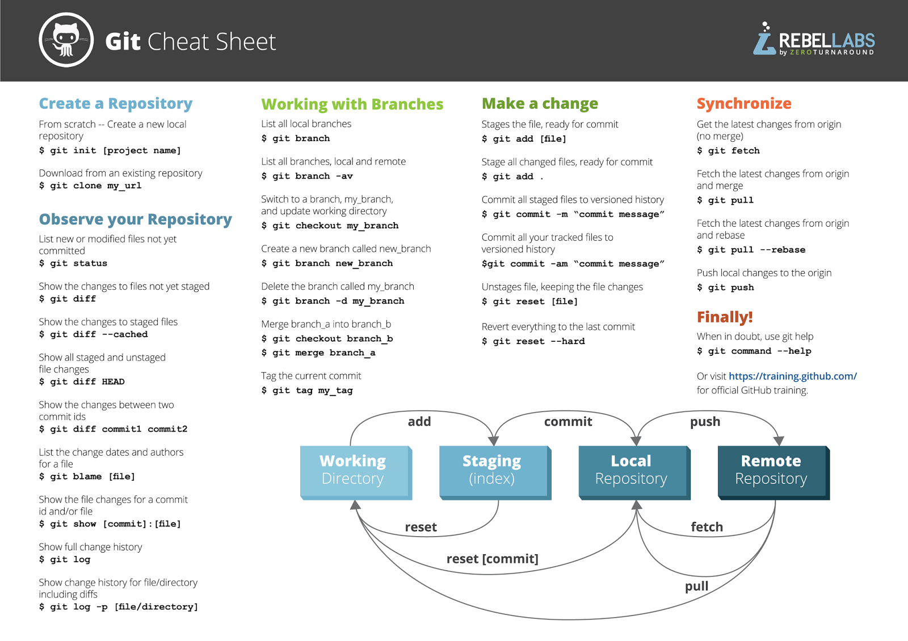

# Resources
Online resources for quick access

---

## Table of Contents

- [GitHub](#github)  
- [GitHub CLI Cheat Sheet](#github-cli-cheat-sheet) 
- [Power BI](#power-bi)  
- [Credits](#credits)  
- [License](#license)  

---

## Github

- **Daily Git Commands**
```
    git status
    git add .
    git commit -m "message" 
    git push
```
- **Create a Branch** 
```
    git checkout -b feature/branch
```
- **Push a Branch** 
```
    git push -u origin feature/branch
```
- **Pull Requests** 
```
    gh pr create --title "My Feature" --body "Description"
```
- **List PRs** 
```
    gh pr list
```
- **Check Out a PR** 
```
    gh pr checkout 123
```
- **Create Issues**
```
    gh issue create --title "Bug: Something broke" --body "Details..."
```
- **List Issues** 
```
    gh issue list
```

- **Approve a PR** 
```
    gh pr review 123 --approve
```

- **Comment on a PR** 
```
    gh pr review 123 --comment --body "Looks good!"
```

- **Request Changes** 
```
    gh pr review 123 --request-changes --body "Please fix this."
```

<!-- - **??? Issues** 
```
    git ???
```

- **??? Issues** 
```
    git ???
``` -->

---
## GitHub CLI Cheat Sheet

### 🟦 **Branches**
```powershell
git checkout -b feature/x
git push -u origin feature/x
```

### 🟩 **Pull Requests**
```powershell
gh pr create -t "Title" -b "Body"
gh pr list
gh pr checkout <id>
```

### 🟧 **Issues**
```powershell
gh issue create -t "Title" -b "Body"
gh issue list
```

### 🟪 **Reviews**
```powershell
gh pr review <id> --approve
gh pr review <id> --comment -b "Note"
gh pr review <id> --request-changes -b "Fix this"
```

### 🟫 **Core Git**
```powershell
git status
git add .
git commit -m "msg"
git push
```

---

---

## Power BI

---

## Tableau

---
## Credits

- **Github:** [Link](https://docs.github.com/en)
- **CoPilot:** [Link](https://copilot.microsoft.com)   
- **JRebel:** [Link](https://www.jrebel.com/blog/git-cheat-sheet)   

- **Dataset Source:** [Link](https://link-to-dataset.com)  
- **Tutorials / References:** [Link](https://link.com)  

---

## License

This project is licensed under the [MIT License](https://choosealicense.com/licenses/mit/) 

---